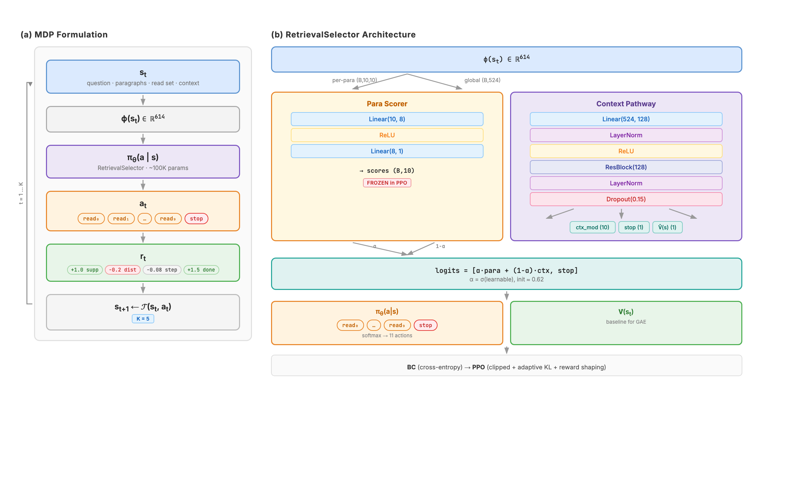
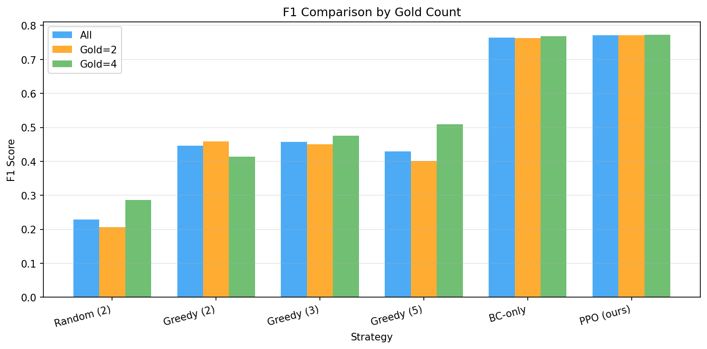
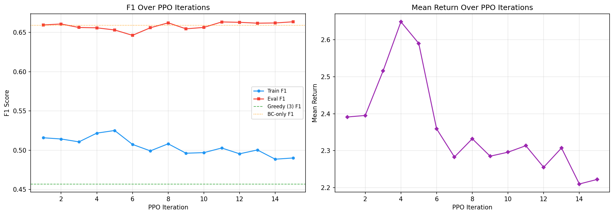
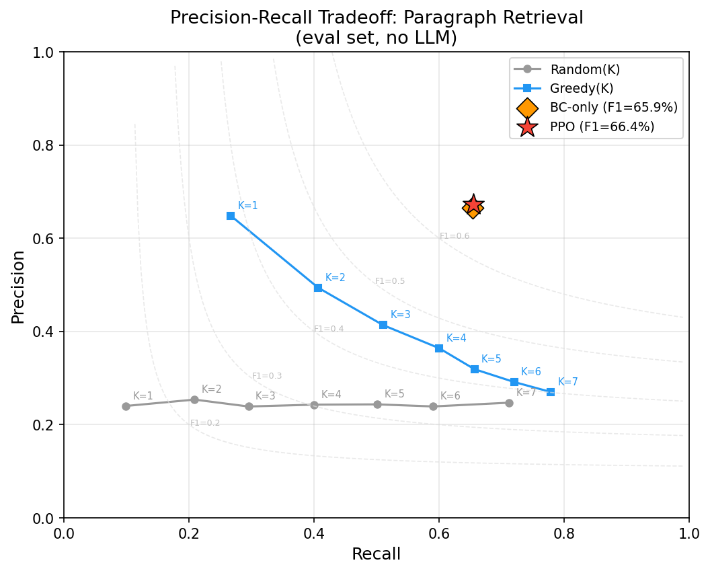
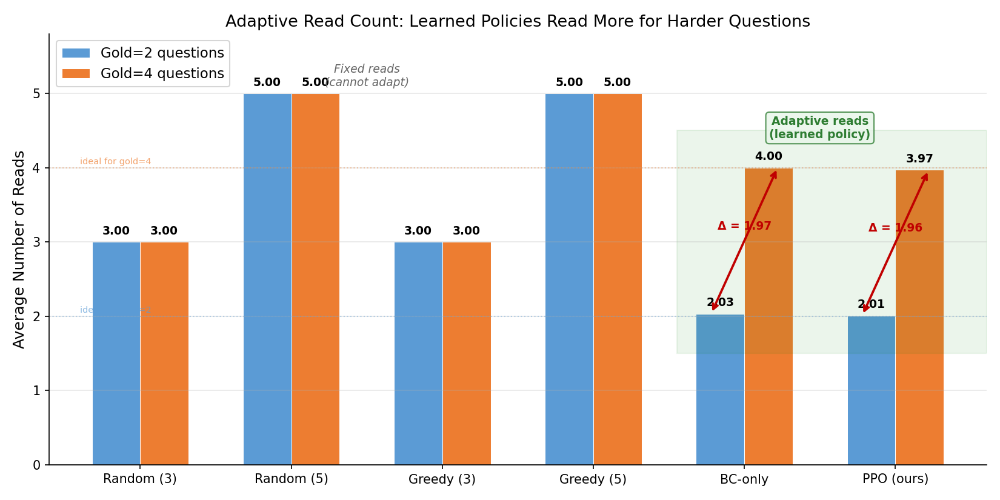
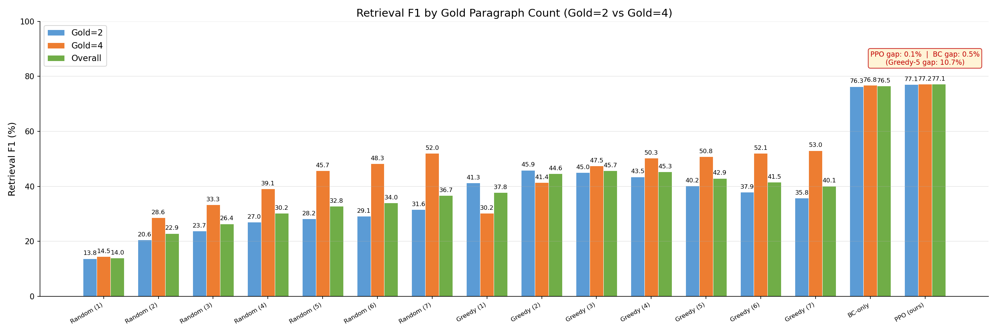
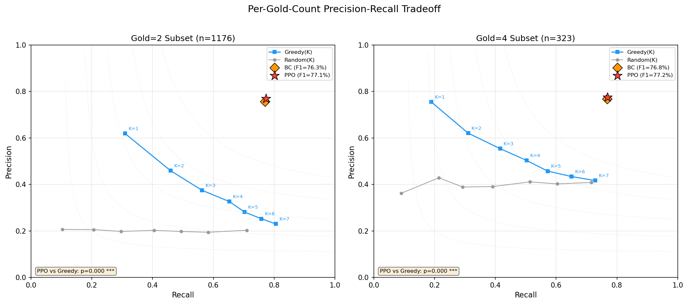

# BC + PPO for Multi-Hop QA Paragraph Retrieval

CS234 Final Project — Learning to select supporting paragraphs for multi-hop question answering using Behavioral Cloning (BC) and Proximal Policy Optimization (PPO).

## Table of Contents

1. [Overview](#overview)
2. [Data](#data)
3. [Method](#method)
4. [Training](#training)
5. [Results](#results)
6. [Cross-Dataset Transfer](#cross-dataset-transfer)
7. [LLM Evaluation & Answer Judging](#llm-evaluation--answer-judging)
8. [File Structure](#file-structure)
9. [How to Run](#how-to-run)

---

## Overview

Multi-hop question answering requires reasoning over multiple documents to find an answer. Given a question and a pool of 10 paragraphs (a mix of gold supporting paragraphs and distractors), our system learns a **sequential retrieval policy** that selects which paragraphs to read before handing the selected context to an LLM for answer generation.

**Pipeline:**
1. **Command 1** (`train_only.py`): Train a BC policy from oracle demonstrations, then fine-tune with PPO using retrieval-only metrics (no LLM calls during training).
2. **Command 2** (`eval_llm.py`): Load trained models, have a local LLM (Qwen3-8B) answer questions using each strategy's selected paragraphs, and measure end-to-end accuracy.

---

## Data

### Dataset

We use **2WikiMultiHopQA** (`framolfese/2WikiMultihopQA` on HuggingFace), a multi-hop reasoning benchmark where each question requires information from exactly 2 or 4 supporting paragraphs (gold paragraphs) out of a pool of 10.

### Blind Mode

By default we run in **blind mode**: all paragraph titles are anonymized to `Para_0`, `Para_1`, ..., `Para_9`. This prevents the policy (and the LLM) from exploiting title-based shortcuts and forces genuine content-based retrieval.

### Data Splits

Data is split into four disjoint sets with stratification to ensure both gold=2 and gold=4 questions appear in every split:

| Split | Full Run | Small Run (`--small`) | Purpose |
|---|---|---|---|
| BC Train | 1,500 | 150 | Behavioral cloning supervision |
| BC Dev | 300 | 30 | BC early stopping validation |
| PPO Train | 3,000 | 250 | PPO on-policy rollouts |
| Eval | 1,000 | 50 | Final held-out evaluation |

### Example Format

Each example contains:
- **question**: The multi-hop question (e.g., "Which film has the director born first, Film A or Film B?")
- **paragraphs**: A list of 10 `(title, [sentences])` tuples
- **supporting_titles**: The set of gold paragraph titles (2 or 4 titles)
- **answer**: The ground-truth answer string

---

## Method



### Problem Formulation

We model paragraph retrieval as a **sequential decision process**:
- **State**: The question, all 10 paragraph texts, which paragraphs have been read so far, and accumulated context
- **Actions**: `read_0` through `read_9` (read a specific paragraph) or `answer` (stop reading and produce an answer). 11 actions total.
- **Budget**: At most K=5 read actions before forced stopping
- **Goal**: Maximize retrieval F1 — select as many gold paragraphs (and as few distractors) as possible within the budget

### Policy Network: `RetrievalSelector`

A dual-path MLP with ~200K parameters:

```
Input features (614-dim):
├── Sentence-Transformer embedding of question (512-dim, all-MiniLM-L6-v2)
├── Per-paragraph cosine similarities (10-dim)
├── Structured features (32-dim):
│   ├── Progress: steps_taken, frac_read, frac_supporting_found (3)
│   ├── Per-paragraph: question word overlap (10), bridge similarity (10)
│   └── Global: coverage, bridge aggregates, step flags (9)
└── Rich per-paragraph features (60-dim, 6 features × 10 paragraphs):
    ├── IDF-weighted word overlap
    ├── Best-sentence cosine similarity
    ├── Paragraph length (normalized)
    ├── Unique word ratio
    ├── Co-occurrence score
    └── Rank feature

Architecture:
┌─────────────────────────────────────────────────────────┐
│  Path A: Per-paragraph scoring ("learned greedy")       │
│    per_para_feats (B, 10, 10) → MLP(10→8→1) → (B, 10) │
│    Initialized to mimic greedy BoW ranking              │
│                                                         │
│  Path B: Context pathway                                │
│    global_feats → Linear→LN→ReLU                        │
│              → ResBlock(Linear→ReLU→Linear)→LN→ReLU     │
│              → Dropout(0.15)                             │
│    → ctx_to_para: Linear→(B, 10) paragraph modulation   │
│    → answer_head: Linear→(B, 1) stop logit              │
│    → value_head:  Linear→(B, 1) state value             │
│                                                         │
│  Combined:                                              │
│    read_logits = α · para_scores + (1-α) · ctx_mod      │
│    α = sigmoid(learnable_param), init ≈ 0.62            │
│    logits = [read_logits(10), answer_logit(1)]          │
└─────────────────────────────────────────────────────────┘
```

### Baselines

| Strategy | Description |
|---|---|
| **Oracle** | Read all gold supporting paragraphs (upper bound) |
| **No Context** | Answer with no paragraphs (lower bound) |
| **Random(K)** | Read K randomly chosen paragraphs |
| **Greedy(K)** | Read top-K paragraphs by BoW word overlap with the question |
| **BC-only** | Behavioral cloning policy trained on oracle demonstrations |

### Behavioral Cloning (BC)

The policy is first trained via supervised learning on oracle demonstrations. At each state, the oracle action is the gold paragraph with the highest per-paragraph score (or `answer` when all golds have been read). Cross-entropy loss, with early stopping on BC Dev F1 (patience=5).

### PPO Fine-Tuning

After BC pre-training, the policy is fine-tuned with PPO using dense per-step rewards (no LLM calls during training):

**Reward structure:**
| Component | Value | Description |
|---|---|---|
| SUPPORTING | +1.0 | Reading a gold supporting paragraph |
| DISTRACTOR | −0.2 | Reading a distractor paragraph |
| STEP_COST | −0.08 | Per-step penalty to encourage efficiency |
| ORDER_BONUS | +0.1 | Reading gold paragraphs in dataset order |
| BRIDGE_BONUS | +0.15 | Reading a paragraph with high bridge entity overlap |
| COMPLETION_BONUS | +1.5 | Finding all gold paragraphs before answering |
| STOP_SCALE | 1.0 | Reward for stopping action |

**Reward shaping:** Potential-based shaping (γΦ(s') − Φ(s)) using a learned reward model (`RewardModel`: 614→64→64→1 with sigmoid output). The shaping coefficient ramps from 0 to 0.2 starting at iteration 3.

**Adaptive KL coefficient:** The KL penalty coefficient auto-tunes to keep the policy's per-step KL divergence from the BC policy in the sweet spot [0.1, 0.4]:
- If KL > 0.4: `kl_coeff *= 2.0` (capped at 0.3)
- If KL < 0.1: `kl_coeff *= 0.8` (floored at 0.005)
- Initial `kl_coeff = 0.03`

**Other PPO details:**
- `para_scorer` (Path A) weights are **frozen** during PPO — only the context pathway is updated
- Clipping ratio ε = 0.2, target KL = 0.05 (for early stopping within each update)
- 4 optimization epochs per PPO update
- Learning rate = 3×10⁻⁵ (Adam), entropy coefficient = 0.02
- PPO patience = 6 iterations of no improvement

---

## Training

### Hyperparameters

| Parameter | Value |
|---|---|
| Sentence encoder | `all-MiniLM-L6-v2` (512-dim) |
| Feature dimension | 614 |
| BC learning rate | 3×10⁻⁵ |
| BC patience | 5 epochs |
| PPO learning rate | 3×10⁻⁵ |
| PPO iterations (full) | 15 |
| PPO batch size | dynamic (one trajectory per question) |
| PPO epochs per update | 4 |
| Discount γ | 0.99 |
| GAE λ | 0.95 |
| Clip ε | 0.2 |
| Entropy coefficient | 0.02 |
| Initial KL coefficient | 0.03 (adaptive) |
| Reward shaping ramp | 0 → 0.2 from iter 3 |
| Budget K | 5 |
| Seed | 42 |

### Two-Command Pipeline

Training and evaluation are split into two commands for modularity:

```bash
# Command 1: Train BC + PPO (no LLM needed)
python train_only.py              # full run
python train_only.py --small      # quick test

# Command 2: Evaluate with LLM (requires Ollama + qwen3:8b)
python eval_llm.py                # full evaluation
python eval_llm.py --small        # quick test
```

Command 1 saves model checkpoints, training curves (CSV + PNG), and a data split file to `checkpoints_blind/`. Command 2 loads these artifacts and runs end-to-end LLM evaluation.

---

## Results

### Retrieval F1 Comparison

All strategies evaluated on 1,000 held-out questions (blind mode, K=5 budget):

| Strategy | Precision | Recall | F1 | Avg Reads |
|---|---|---|---|---|
| Random (1) | 24.0% | 9.9% | 14.0% | 1.0 |
| Random (2) | 25.4% | 20.9% | 22.9% | 2.0 |
| Random (3) | 23.9% | 29.5% | 26.4% | 3.0 |
| Random (4) | 24.3% | 40.0% | 30.2% | 4.0 |
| Random (5) | 24.4% | 50.1% | 32.8% | 5.0 |
| Random (6) | 23.9% | 59.0% | 34.0% | 6.0 |
| Random (7) | 24.7% | 71.2% | 36.7% | 7.0 |
| Greedy (1) | 64.8% | 26.7% | 37.8% | 1.0 |
| Greedy (2) | 49.4% | 40.6% | 44.6% | 2.0 |
| Greedy (3) | 41.4% | 51.0% | 45.7% | 3.0 |
| Greedy (4) | 36.4% | 60.0% | 45.3% | 4.0 |
| Greedy (5) | 31.9% | 65.6% | 42.9% | 5.0 |
| Greedy (6) | 29.2% | 72.0% | 41.5% | 6.0 |
| Greedy (7) | 27.0% | 77.8% | 40.1% | 7.0 |
| BC-only | 76.1% | 76.9% | **76.5%** | 2.5 |
| **PPO (ours)** | **77.1%** | **77.2%** | **77.1%** | **2.4** |

**Significance tests** (paired permutation, one-sided, 10,000 permutations):
- PPO vs BC: p = 0.0176 \*
- PPO vs best Greedy: p = 0.0000 \*\*\*



### PPO Training Curve

PPO fine-tuning over 15 iterations, starting from the BC checkpoint:



> **Why is train F1 (~64%) lower than eval F1 (~77%)?** During PPO rollouts the policy **samples** actions stochastically (for exploration), while evaluation uses **argmax** (greedy decoding). Stochastic sampling occasionally picks suboptimal paragraphs, lowering train-time F1. Additionally, each PPO iteration only rolls out on a random 50% subset of the 3,000 training questions, adding variance. The eval F1 (computed deterministically on 1,000 held-out questions) is the true measure of policy quality.

### Precision / Recall



### Adaptiveness: Gold=2 vs Gold=4

A key advantage of the learned policy is its **adaptiveness** across question difficulty. Gold=2 questions require finding 2 supporting paragraphs out of 10; gold=4 questions require 4 — a much harder task for fixed-budget strategies.

**Adaptive read count:** Fixed strategies (Random, Greedy) always read the same number of paragraphs regardless of question difficulty. In contrast, PPO learns to **dynamically adjust** how many paragraphs to read:

| Strategy | Gold=2 Reads | Gold=4 Reads | Adapts? |
|---|---|---|---|
| Random (K) | K | K | ✗ Fixed |
| Greedy (K) | K | K | ✗ Fixed |
| BC-only | 2.03 | 4.00 | ✓ Adaptive |
| **PPO (ours)** | **2.01** | **3.97** | **✓ Adaptive** |

PPO reads ~2 paragraphs for gold=2 questions and ~4 for gold=4, closely matching the true number of supporting paragraphs in each case. This adaptive behavior is **learned entirely from reward signals** — the policy is never told how many gold paragraphs exist.



**Retrieval F1 by difficulty:**

| Strategy | Gold=2 F1 | Gold=4 F1 | Gap |
|---|---|---|---|
| Greedy (5) | 40.2% | 50.8% | 10.7% |
| BC-only | 76.3% | 76.8% | 0.5% |
| **PPO (ours)** | **77.1%** | **77.2%** | **0.1%** |

PPO achieves nearly identical F1 on both difficulty levels (gap = 0.1%), confirming that the adaptive reading strategy translates to consistent performance.





---

## Cross-Dataset Transfer

To test whether the learned retrieval policy generalizes beyond 2WikiMultiHopQA, we evaluate the trained BC, SFT+DPO, and PPO models **zero-shot** on HotpotQA — a different multi-hop QA dataset the models never saw during training. No retraining or fine-tuning is performed; we simply load the saved 2Wiki-trained weights and run retrieval evaluation on 1,500 HotpotQA questions.

Both datasets share the same structure (10 candidate paragraphs, 2 gold supporting paragraphs for HotpotQA), the same 614-dim BoW feature space, and the same blind-mode title anonymization.

### Zero-Shot Transfer Results

| Strategy | Precision | Recall | F1 | Avg Reads |
|---|---|---|---|---|
| Greedy (2) | 44.7% | 44.7% | 44.7% | 2.0 |
| BC (zero-shot) | 49.1% | 51.2% | 50.1% | 2.1 |
| SFT+DPO (zero-shot) | 30.6% | 58.0% | 40.1% | 3.8 |
| **PPO (zero-shot)** | **50.9%** | **53.0%** | **51.9%** | **2.1** |

**Significance tests** (paired permutation, one-sided, 10,000 permutations):
- PPO vs best Greedy: p = 0.0000 \*\*\*
- PPO vs BC: p = 0.0000 \*\*\*
- PPO vs SFT+DPO: p = 0.0000 \*\*\*
- BC vs best Greedy: p = 0.0000 \*\*\*
- SFT+DPO vs best Greedy: p = 1.0000 n.s.
- SFT+DPO vs BC-only: p = 1.0000 n.s.

### Side-by-Side: HotpotQA (transfer) vs 2Wiki (in-domain)

| Method | HotpotQA F1 | 2Wiki F1 | Delta |
|---|---|---|---|
| Best Greedy | 44.7% | 45.7% | −1.0% |
| BC | 50.1% | 65.9% | −15.8% |
| SFT+DPO | 40.1% | 54.7% | −14.6% |
| PPO | 51.9% | 66.4% | −14.4% |

### Key Findings

- **The policies transfer.** Both BC and PPO significantly outperform greedy baselines on HotpotQA (p < 0.001), retaining ~78% of their in-domain F1. The learned retrieval skills are not purely dataset-specific.
- **PPO transfers better than BC.** PPO outperforms BC on HotpotQA (51.9% vs 50.1%, p < 0.001), suggesting RL fine-tuning learned more robust retrieval heuristics than pure imitation.
- **SFT+DPO does not transfer.** SFT+DPO scores 40.1% F1 on HotpotQA — worse than the best greedy baseline (44.7%, p = 1.0 n.s.). DPO was already the weakest learned method on 2Wiki (54.7%) and degrades further on transfer. The cause is an over-reading bias: DPO reads ~3.8 paragraphs on HotpotQA (vs ~2.1 for BC/PPO), tanking precision (30.6%) on a dataset where gold=2 for every question.
- **Adaptive reading transfers.** PPO reads ~2.1 paragraphs on HotpotQA (which always has gold=2), matching its learned behavior from 2Wiki's gold=2 subset.
- **Greedy is dataset-agnostic.** Greedy's F1 barely changes across datasets (−1.0%), as expected for a simple word-overlap heuristic. The learned policies' larger drop (−14.4%) reflects some 2Wiki-specific patterns, but the majority of the learned behavior generalizes.

---

## LLM Evaluation & Answer Judging

### Overview

`eval_llm.py` runs **Command 2**: it loads the trained BC and PPO models from Command 1, then evaluates all strategies by having a local LLM (Qwen3-8B via Ollama) generate answers using each strategy's selected paragraphs.

### Step 1: Pre-filtering Hard Questions

Before evaluation, we filter out "easy" questions that the LLM can answer correctly **without any context** (using only its parametric knowledge). This ensures we only measure retrieval quality on questions where context actually matters.

**How it works:**
1. For each candidate eval question, ask the LLM the question with no paragraphs (using the `NO_CONTEXT_PROMPT` template).
2. Score the LLM's answer against the ground truth using the cascaded scorer (see below).
3. If the score > 0.8 (i.e., the LLM already knows the answer), **skip** this question.
4. Keep only questions the LLM gets wrong without context — these are the "hard" questions.
5. Results are cached to disk (`prefilter_cache.json`) so re-runs skip LLM calls.

The target is 100 hard questions for the full run (50 for `--small`).

### Step 2: Running All Strategies

For each hard question, every strategy (Oracle, No Context, Random, Greedy, BC, PPO) selects its paragraphs. The selected paragraphs are formatted and sent to the LLM with the `ANSWER_PROMPT`:

```
You are answering a multi-hop question. Use ONLY the provided paragraphs to answer.

## Question
{question}

## Paragraphs
{selected paragraphs text}

Reply with ONLY the answer, nothing else.
ANSWER:
```

The LLM generates a short answer for each strategy.

### Step 3: Cascaded Answer Scoring

Each LLM answer is scored against the ground truth using a **three-stage cascade** in `TaskScorer.score_answer()`:

1. **Exact match**: Normalize both strings (lowercase, remove punctuation, strip articles a/an/the), then check equality. Score = 1.0 if match.
2. **Substring containment**: Check if the normalized ground truth is contained within the normalized prediction. Score = 1.0 if contained. This handles cases like the LLM answering "The answer is Paris" when the ground truth is "Paris".
3. **LLM-as-judge**: If neither text match succeeds, call the LLM itself as a judge. The judge prompt asks:

   ```
   You are a strict answer judge. Does the predicted answer match the ground truth?
   They need not be identical, but must refer to the same entity/fact.

   Ground truth: {ground_truth}
   Prediction: {prediction}

   Reply with ONLY one word: CORRECT or INCORRECT.
   ```

   Score = 1.0 if the judge says "CORRECT" (and not "INCORRECT"), else 0.0. The judge's results are cached to avoid redundant LLM calls.

This cascade is efficient: most answers are resolved by cheap string matching; the LLM judge is only called for ambiguous cases (e.g., "NYC" vs "New York City", date format differences).

### Step 4: Significance Testing

After scoring all strategies, pairwise **paired permutation tests** (one-sided, 10,000 permutations) determine whether differences are statistically significant:
- PPO vs BC
- PPO vs each Greedy baseline
- Per-gold-count breakdowns (gold=2 and gold=4 separately)

Significance levels: \* p < 0.05, \*\* p < 0.01, \*\*\* p < 0.001.

### Output

Results are saved to `results/`:
- `report.txt`: Full text report with tables, significance tests, and training curve summary
- `comparison.json`: Machine-readable results for all strategies

### LLM Eval Results (Small-Scale)

**Setup**: 50 hard questions from 2WikiMultiHopQA (blind mode). Questions pre-filtered to exclude those answerable without context. LLM: Qwen3-8B via Ollama. Answer accuracy scored via cascaded exact-match → containment → LLM-as-judge.

| Strategy | Accuracy | Reads | Supp Found | Prec | Recall | F1 |
|---|---|---|---|---|---|---|
| Oracle | 95.0% | 2.0 | 2.0 | 100% | 100% | 100% |
| No Context | 30.0% | 0.0 | 0.0 | 0% | 0% | 0% |
| Random (2) | 65.0% | 2.0 | 0.5 | 22% | 22% | 22% |
| Greedy (2) | 55.0% | 2.0 | 0.9 | 45% | 45% | 45% |
| Greedy (4) | 70.0% | 4.0 | 1.1 | 29% | 57% | 38% |
| BC-only | 70.0% | 2.1 | 1.6 | 76% | 80% | 78% |
| **PPO (ours)** | **75.0%** | **2.1** | **1.6** | **76%** | **80%** | **78%** |

- **Accuracy** = fraction of questions the LLM answered correctly given the selected paragraphs
- PPO achieves the highest answer accuracy (75%) while reading only ~2.1 paragraphs on average
- BC and PPO have identical retrieval quality (F1=78%), but PPO's better paragraph selection leads to +5% answer accuracy over BC
- Oracle accuracy is 95% (not 100%) because even with perfect paragraphs, the LLM occasionally errs
- Note: 50 questions is a small sample; full-scale eval (100+ questions) recommended for significance testing

---

## File Structure

```
.
├── train_only.py            # Command 1: BC + PPO training (no LLM)
├── eval_llm.py              # Command 2: LLM-based evaluation
├── ppo_finetuner.py         # PPOFineTuner, RetrievalSelector, TaskScorer,
│                            #   reward computation, feature extraction
├── hotpot_pipeline.py       # Data loading (2Wiki/HotpotQA), blind mode,
│                            #   pre-filtering, report generation, baselines
├── multi_agent_baseline.py  # RetrievalAgent (LLM interface), trajectory
│                            #   data structures, baseline strategies
├── eval_transfer.py         # Zero-shot cross-dataset transfer eval
│                            #   (2Wiki-trained models → HotpotQA)
├── plot_results.py          # Regenerate result plots from train_metrics.json
│                            #   (f1_by_gold_count, adaptive_reads, f1_comparison_bar)
├── plot_architecture.py     # Generate model architecture figure
├── run_modal.py             # Modal cloud deployment (optional)
├── requirements.txt         # Python dependencies
├── checkpoints_blind/       # Saved models & training artifacts
│   ├── split.json           #   Data split (train/dev/eval IDs)
│   ├── bc_model.pt          #   BC model weights
│   ├── ppo_best.pt          #   Best PPO model weights
│   ├── ckpt_iter_*.pt       #   Per-iteration PPO checkpoints
│   ├── train_metrics.json   #   Training metrics (JSON)
│   ├── bc_loss_curve.csv    #   BC training loss curve
│   ├── ppo_training_curve.csv/png  # PPO training curve
│   └── *.png                #   Visualization plots
├── results/                 # Evaluation outputs (from Command 2)
│   ├── report.txt           #   Detailed evaluation report
│   └── comparison.json      #   Strategy comparison (JSON)
└── results_transfer/        # Cross-dataset transfer outputs
    ├── report.txt           #   Transfer evaluation report
    ├── transfer_metrics.json #  Full metrics (JSON)
    └── transfer_comparison.csv # CSV table for plotting
```

---

## How to Run

### Prerequisites

- Python 3.10+
- [Ollama](https://ollama.ai/) installed and running with `qwen3:8b` (only needed for Command 2)

### Setup

```bash
pip install -r requirements.txt

# For Command 2 only: start Ollama and pull the model
ollama pull qwen3:8b
```

### Quick Test

```bash
# Step 1: Train BC + PPO (no LLM needed, ~2 min)
python train_only.py --small

# Step 2: Regenerate result plots from saved metrics
python plot_results.py

# Step 3: Evaluate with LLM (~10 min, requires Ollama)
python eval_llm.py --small

# Step 4: Cross-dataset transfer eval (~1 min, no LLM needed)
python eval_transfer.py --small
```

### Full Run

```bash
# Step 1: Train BC + PPO (~30 min on CPU)
python train_only.py

# Step 2: Regenerate result plots (f1_by_gold_count, adaptive_reads, f1_comparison_bar)
python plot_results.py

# Step 3: Evaluate with LLM (~1 hr, requires Ollama)
python eval_llm.py

# Step 4: Cross-dataset transfer eval (~1 min, no LLM needed)
python eval_transfer.py
```

> **Note:** `train_only.py` generates most plots automatically, but `plot_results.py` regenerates them from the saved `train_metrics.json` — useful if you change plotting code without retraining. Run it after Step 1 to ensure all figures are up to date.

### Options

| Flag | Command | Effect |
|---|---|---|
| `--small` | Both | Reduced data for quick testing |
| `--no-blind` | Both | Use real paragraph titles instead of anonymized |
| `--hotpot` | `train_only.py` | Use HotpotQA dataset instead of 2Wiki |
| `--no-prefilter` | `eval_llm.py` | Skip the no-context pre-filter |

### Cloud Deployment (Optional)

For running on Modal (cloud GPU):

```bash
pip install modal
modal setup
modal run run_modal.py
```
